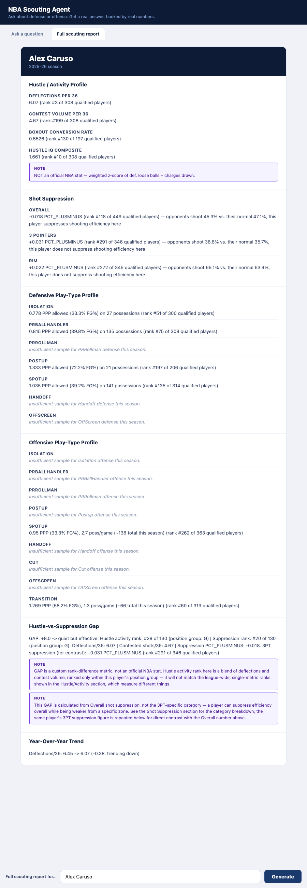
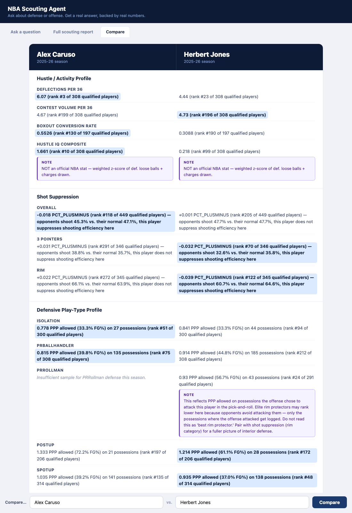

# NBA Scouting Agent

A natural-language scouting analytics tool built on public NBA data. Ask a defensive or offensive question in plain English, get a ranked answer backed by real numbers: no hallucinated statistics, no vague summaries.

Live at [nba-scouting-agent.onrender.com](https://nba-scouting-agent.onrender.com). Free-tier hosting — the first request after a period of inactivity may take up to 50 seconds while the instance spins up. Subsequent requests are fast.

Can also be run locally — see "Running the Tool" below.

---

## Screenshots

A full scouting report for a single player, assembled from relevant compute functions with honest section-level qualification checks (screenshot predates the Drive Efficiency and Signature Play Type sections added later):



Head-to-head comparison mode, reusing the same report-assembly logic — this example shows the project's core activity-vs-suppression finding directly: Caruso's hustle numbers lead, but shot suppression tells a different story:



---

## What This Is

The agent accepts free-text scouting questions and routes them to the right analytic function. Questions like "who contests the most shots at the rim?" or "which players have improved the most in deflections this year?" resolve directly to ranked player tables pulled from `nba_api` data. The interface is a single-page chat UI with suggestion chips, a stat card for the top result, and a ranked mini-list that's always visible.

The routing architecture is deterministic-first: a regex rule set handles the majority of recognizable question patterns without touching a language model. The LLM (Groq / Llama-3.3-70b) is used only for structured classification decisions: routing ambiguous questions to the right function, or returning a `needs_clarification` response when a question is genuinely underspecified. The LLM never generates statistics, rankings, or player names. Every number in every answer comes directly from the underlying data.

---

## What This Is Not

This does not compete with what NBA front offices actually use for decisions.

NBA teams have access to:
- **Second Spectrum** player tracking data: precise on-ball defensive positioning, coverage assignments, foot speed, help rotations, and more, derived from arena camera systems
- **Synergy full subscriptions**: play-by-play tagging with clip access and opponent-adjusted context
- **Medical and biometric data**: injury history, load management metrics, sleep and recovery tracking
- **Proprietary draft intelligence**: physical testing results, psychological profiling, private workouts
- **Lineup-level context**: on/off defensive rating, scheme tagging (zone vs. man, switching vs. drop), opponent quality adjustments

This tool is built on public `nba_api` endpoints (hustle activity, shot suppression by zone, Synergy play-type efficiency offensive and defensive, drive efficiency, signature play type, year-over-year trends) plus a public-source college draft-class layer (2026 class only, via sports-reference.com/cbb). That is a meaningful slice of what matters, but it is not the whole picture, and the tool says so explicitly when questions land outside its data coverage.

---

## Why It Exists

The value is not the data. It's the interface.

In most sports organizations, analytics analysts are the bottleneck between a question and an answer. A coach or scout has a question at 10pm; the analyst who can run the query isn't available until morning. A simple question, "who in this draft class has the best pick-and-roll defense?", might take 20 minutes for an analyst to pull and format correctly, and zero seconds to ask out loud.

A trustworthy natural-language interface over an analytics dataset changes that calculus. The key word is trustworthy. An interface that sometimes returns hallucinated statistics or quietly misroutes questions to the wrong function is worse than no interface at all, because it erodes confidence in the data itself.

This project is a demonstration of how to build that interface correctly: with honest scope boundaries, explicit caveats where the data has known limitations, and a routing architecture that fails loudly rather than silently.

---

## Architecture

```
User question
     │
     ▼
Deterministic regex router (_RULES, ~20 rules)
     │                    │
     │ match              │ no match
     │                    ▼
     │           LLM structured classifier (Groq)
     │                    │
     │         ┌──────────┼──────────┐
     │         │          │          │
     │    function    out_of_scope  needs_clarification
     │         │
     └────►  compute function
               │
               ▼
         ranked DataFrame → JSON → chat UI
```

**Backend:** FastAPI (`api.py`), serving both the `/query`/`/report`/`/compare` endpoints and the static frontend. Two DataFrames (current + prior season) are loaded once at startup via FastAPI's lifespan context manager and passed to every query.

**Compute layer:** `compute_defense.py`, `compute_offense.py`, and `compute_college.py` contain pure functions that take DataFrames (or read their own CSVs, for the college layer) and return ranked DataFrames. No side effects, no network calls, no LLM involvement.

**Router:** `query_router.py` handles routing, formatting, and answer construction across 14 statistical functions. The LLM is called only when the regex rules produce no match — this includes `signature_play_type` by design, since it needs an arbitrary NBA player's name extracted from free text, and no deterministic name list exists for that the way the fixed 60-player college draft class does.

**Frontend:** Single-file vanilla JS chat UI (`chat/index.html`). No framework, no build step. Suggestion chips, a stat card with mini top-5 always visible for ranked answers, a distinct player-detail card for single-player breakdowns (signature play type, college lookup), follow-up chips, full-table toggle, skeleton loading state, and a refined empty state.

---

## Current Data Coverage

| Layer | Source | Functions |
|---|---|---|
| Hustle activity | `LeagueHustleStatsPlayer` | `deflections_per36`, `contest_profile_per36`, `boxout_conversion`, `hustle_iq_composite` |
| Shot suppression | `LeagueDashPtDefend` | `shot_suppression` (Overall, 2PT, 3PT, rim) |
| Activity vs. outcome gap | derived | `hustle_vs_suppression_gap` |
| Defensive play-type efficiency | `SynergyPlayTypes` (Defensive) | `playtype_defense` (7 categories) |
| Offensive play-type efficiency | `SynergyPlayTypes` (Offensive) | `playtype_offense` (9 categories, including Cut + Transition) |
| Drive efficiency | `LeagueDashPtStats` | `drive_efficiency` (points/drive, drive FG%, playmaking on drives) |
| Signature play type | derived from `playtype_offense` | `signature_play_type` (a player's standout offensive category by percentile) |
| Year-over-year trends | derived from 2024-25 + 2025-26 | `year_over_year_delta` |
| 2026 college draft class | sports-reference.com/cbb | `college_player_lookup`, `college_leaderboard`, `college_efficiency_volume`, `youth_adjusted_leaderboard` |

Seasons covered: 2025-26 (current NBA), 2024-25 (prior NBA, for YoY comparisons), 2025-26 college season for the 2026 draft class.

### Offensive play-type efficiency (complete)

`playtype_offense` covers all 9 Synergy offensive categories: Isolation, PRBallHandler, PRRollman, Postup, Spotup, Handoff, Cut, OffScreen, and Transition. Two category-specific decisions came out of building this:

- **Cut is routed by volume, not PPP.** Every other category ranks by points-per-possession; Cut ranks by possession count (`POSS`) descending instead. A cut's efficiency is mechanically determined by whether the pass arrives, it's a finishing action, not a decision-making one, so a PPP ranking on Cut mostly measures who gets the most easy dunks, not who cuts well. Volume is the more honest signal.
- **OffScreen carries a possession-count caveat.** At the default sample-size threshold, top qualifiers sit at 57-76 total possessions for the season: real usage, but a modest sample to hang a full-season efficiency ranking on. The answer surfaces this directly rather than presenting a thin sample with the same confidence as a 400-possession Spotup ranking.

The router disambiguates offense/defense on overlapping phrasing: "pick-and-roll," "post," and "isolation" all mean different functions depending on whether the question is about the player initiating the action or defending it. `test_router.py` now runs 45 questions (up from 23), including dedicated PRBallHandler/PRRollman disambiguation cases (Q30-Q33), drive-efficiency cases (Q34-Q35), college draft-class cases (Q36-Q41), signature play-type cases (Q42-Q43), and youth-adjusted-leaderboard cases (Q44-Q45).

### Drive efficiency (complete)

`drive_efficiency` (from `LeagueDashPtStats`, `pt_measure_type='Drives'`) ranks players by points scored per drive (`PTS_PER_DRIVE` — drive points including drawn fouls, not raw drive FG% alone), and surfaces drive-passing/assist/turnover rates alongside it so volume, scoring efficiency, and playmaking on drives can be read together. `PTS_PER_DRIVE` and `DRIVE_FG_PCT` correlate at only ~0.59 across qualifiers; the answer flags it directly when a player's points-per-drive is being propped up by drawn fouls rather than raw shooting. Wired into the router, the `/report` scouting-report sections, and `/compare` head-to-head (reused automatically, same as every other section).

### Signature play type (complete)

`signature_play_type` identifies a player's standout offensive category — not their single highest-PPP category, but the qualifying category where they most exceed expectations relative to how much they run it, ranked by `PERCENTILE` rather than raw efficiency. Two thresholds, both derived from the real data rather than guessed:

- **A tie margin of 0.04** (4 percentile points): if two or more qualifying categories are within this margin of the top one, the answer reports a genuine multi-category strength rather than arbitrarily picking a single "winner." Checked against the real cross-category percentile-gap distribution (377 players who qualify in 2+ categories): the gap between a player's best and second-best category has a median of 0.139 and a p25 of 0.051, so 0.04 is a real, selective minority case (18.8% of players), not an arbitrary cutoff.
- **A minimum percentile floor of 0.60**: a player's own best category has to clear this before it's called a "signature" at all. Without it, a role player whose best category is merely the 45th percentile would get a "signature play type" that isn't actually a strength. The floor sits below the real median best-category percentile (0.783 across 356 multi-category players), so it's a genuine below-average bar, not an arbitrary round number.

`Cut` is excluded from signature detection, consistent with `playtype_offense`'s own established reasoning that PPP/percentile isn't a meaningful efficiency signal for that category (see the offensive play-type section above).

Unlike every other function in this tool, `signature_play_type` has **no deterministic `_RULES` entry** — it's LLM-fallback only. Extracting an arbitrary NBA player's name from free text isn't something the regex router can do; the college-lookup functions below only manage deterministic name matching because the 2026 draft class is a small, fixed, enumerable list of 60 names, and no equivalent full-league name list exists to build the same kind of pattern for active NBA players.

Wired into `/report` and `/compare` as a "Signature Play Type" section, following the same qualified/unqualified pattern as every other section.

### 2026 college draft class (complete, integrated)

`compute_college.py` turns the batch-pulled college data into four queryable functions, wired into the router the same way as every NBA-side function:

- **`college_player_lookup(name)`** — a single prospect's final college season stats. Case-insensitive substring matching (`"Karaban"` resolves to Alex Karaban), but raises a `ValueError` rather than silently picking a match on a genuine ambiguity (e.g. `"Cameron"` matches both Cameron Boozer and Cameron Carr) — not currently a risk with this specific 60-player list (no in-list collisions as of this dataset), but the guard costs nothing and the list isn't guaranteed to stay collision-free if it's ever extended.
- **`college_leaderboard(metric)`** — ranks the class by any tracked stat (PTS, TRB, AST, USG%, TS%, BPM, PER). International picks (6 of 60, no NCAA data source) are always excluded, and every answer states that exclusion explicitly rather than silently narrowing the pool — the same honesty-about-scope standard Design Principle 2's caveats apply on the NBA side.
- **`college_efficiency_volume()`** — TS% among high-usage prospects (≥24.5% USG, the qualified pool's own median), the same volume-vs-efficiency framing this tool applies everywhere else on the NBA side. When the TS% margin between the top two qualifiers is thin (checked against the real distribution: a threshold of 1.0 percentage points sits above all but 2 of 27 real consecutive-rank gaps) and the runner-up leads decisively on BPM/PER instead, the answer surfaces that explicitly rather than presenting a 0.3-point TS% edge with unearned confidence.
- **`youth_adjusted_leaderboard(metric)`** — the same ranking as `college_leaderboard` for BPM or PER, annotated with each player's class year, and flagging any freshman or sophomore who ranks in the top half of the 54-player qualified pool (29 SR / 15 FR / 7 SO / 3 JR). The name and framing are deliberately conservative: this is **not** a validated age-adjusted formula. This dataset is a single draft class with no multi-year historical baseline to establish what "adjusted for youth" should mean quantitatively — the flag states a plain, checkable fact within this one pool ("this FR/SO ranks in the top half of this specific 54-player class on this metric"), not a claim about age-normalized performance. In the real data, this isn't a one-player fluke: 13 of 54 qualifiers are flagged on BPM and 12 of 54 on PER, led in both cases by Cameron Boozer (FR, Duke) at 18.7 BPM / 33.7 PER — the #1 overall player in the class on both metrics, not just the top freshman.

To scope this extension, `explore_college.py` and `pull_2026_draft_class.py` first proved out a sports-reference.com/cbb access pattern (per-player visible tables + advanced stats hidden in HTML comment blocks) against 5 known 2026 draft picks, all of which resolved correctly and matched public expectations. `pull_2026_draft_class.py` is the full 60-pick batch pull that produces `draft_class_2026.csv`, the CSV the four functions above read. It handles international picks, unresolved school assignments, slug-collision risk (e.g. Cameron Boozer vs. twin brother Cayden Boozer), and sports-reference's rate limiting: 5-6s delay between every request, chunked batches with 60-90s pauses between chunks, 429-aware retry/backoff, and incremental CSV writes so a mid-run stop still leaves completed rows on disk. Resumable via `python scripts/pull_2026_draft_class.py <resume_from_pick>` (defaults to pick 1). A full run is ~8-10+ minutes by design — this is deliberate pacing against a rate-limited public source (see "Working With External Data Sources Responsibly" below), not something to optimize away. It runs as a standalone data-refresh script (via `refresh_data.sh`, below), not live at query time — the router reads the CSV it produces.

---

## Design Principles

These aren't aspirational guidelines. They're conclusions from building this specific tool and finding out what broke.

### 1. Deterministic routing first; LLM only for structured decisions

The LLM never touches a number. It classifies which function to call (or returns `out_of_scope` / `needs_clarification`). Every statistic, ranking, and player name in an answer is computed directly from the underlying data.

This means the tool can be tested exhaustively. `test_router.py` runs 45 questions and checks that each routes to the right function with the right parameters. That test suite is the correctness guarantee, not the LLM.

### 2. Activity metrics and outcome metrics diverge more than they agree

The most consistent finding across building this tool: metrics that measure how much a player *does* something frequently disagree with metrics that measure whether doing it *works*.

Concrete examples found in this data:

- **Alex Caruso** leads the league in deflections per 36 minutes. His shot suppression numbers are unremarkable: he creates turnovers, but doesn't hold opponents to below-average FG% when defending shots directly.
- **Donovan Clingan** is #1 in 3PT contest volume (4.82 contested 3PT per 36) but ranks #279 in 3PT shot suppression: opponents shoot *above* their normal rate against him on perimeter contests. He's closing out but not affecting the shot.
- The same gap exists at the rim: Clingan is #1 in 2PT contest volume but #21 in rim suppression. Gobert is #10 in 2PT contest volume but #29 in suppression.
- **PRRollman selection effect**: elite rim protectors like Gobert show misleading PPP-allowed numbers in pick-and-roll defense because opposing offenses *avoid attacking them*. Only the possessions where the offense chose to attack get logged, which systematically underrepresents the best defenders.

Every contest-volume answer in the tool includes a caveat pointing to the corresponding suppression function. Every PRRollman answer includes the selection-effect caveat. These aren't disclaimers added as an afterthought, they're the correct answer to the question.

### 3. Sample-size floors should be per-category, not one flat number

A blanket `min_games=40` threshold doesn't work across play types with wildly different volume distributions. Postup has 149 players; Spotup has 400. PRRollman possessions per game peak at 5.2; Spotup peaks at 6.6. The right floor for each category is derived from its actual possession distribution (p25-p35 of `POSS`, combined with a minimum total-possessions check of 30).

The total-possessions check (`POSS/g × GP ≥ 30`) catches a class of errors the per-game floor misses: players like Josh Minott (16 GP, 0.9 poss/g = 14 total possessions) who top efficiency lists on micro-samples and would otherwise appear as the #1 handoff scorer in the league.

### 4. `needs_clarification` is not the same as `out_of_scope`

"Who's trending up defensively this year?" is in scope, the tool has year-over-year data. But it's underspecified: trending up in *which* metric, and which direction? Returning `out_of_scope` would be a lie. Returning a generic answer by guessing a metric would be worse.

The router has a third response type, `needs_clarification`, with its own distinct UI treatment (purple badge, separate message style). Questions that are in-scope but ambiguous get an honest "I need more information" response rather than a silent best-guess or a false rejection. Conflating underspecified with out-of-scope trains users to distrust the tool's scope claims.

### 5. AI-assisted development requires the same verification discipline as any other output

Several consequential bugs in this project were introduced during AI-assisted development and caught only through explicit verification:

- **The fabricated test pass**: An LLM-assisted code change reported all 23 routing tests passing. Manual re-run showed Q16 ("which player has good hustle numbers that don't translate to results?") was routing to `hustle_iq_composite` instead of `hustle_vs_suppression_gap`. The regex rule ordering had been silently changed, and the test result had been described rather than actually run.
- **The rank-pool mismatch**: The `hustle_vs_suppression_gap` function was described in comments as "positive GAP = high hustle activity + poor suppression." The actual arithmetic was the opposite. The gap had the right magnitude but the wrong semantic direction: answers about "quiet but effective" defenders were returning the opposite set of players. Caught by manually checking five known players against the output.
- **The sign-convention bug**: `PCT_PLUSMINUS` in `shot_suppression` is negative when the defender is good (opponents shoot below their normal rate). Early formatting code was displaying this without a sign, making elite defenders appear to have a negative metric rather than a favorable one. Caught during the first manual review of formatted output.

The pattern in all three: the code ran without errors, the outputs looked plausible, and the mistake was only visible when the output was checked against known ground truth. Automated tests catch regressions; they don't catch plausible-looking wrong answers. The verification step is not optional.

### 6. The volume-vs-outcome pattern isn't defense-specific

Building the offensive play-type layer confirmed that Principle 2 is bigger than defense. USG% and possession volume on offense play the same role that contest volume plays on defense: they measure how much a player *does* something, not whether it *works*. A high-usage player and an efficient scorer are different questions, and the tool answers them separately rather than conflating "gets the ball a lot" with "is good with it," the same discipline that produced the PRRollman selection-effect caveat and the 2PT/3PT closeout caveats on the defensive side now applies symmetrically on offense.

### 7. Verify claims *about* data, not just the data itself

A distinct failure mode surfaced during the college-scouting exploration, separate from the fabricated-test-pass and sign-convention bugs above: the underlying data pulled was completely accurate, but a conclusion drawn from it, "none of these players are drafted yet, they're still in college," was wrong. The data (2025-26 season stats, `Class: FR`) was real and correctly pulled; the inference built on top of it ignored a fact the data itself couldn't contain, that the 2026 draft had already happened three weeks prior.

This is a sharper failure than a wrong number, because the numbers were right. Automated verification (rerun the scraper, check the table) would have passed cleanly. The only thing that caught it was the user supplying a fact outside the dataset. The lesson generalizes: verifying that a pulled number is correct is necessary but not sufficient. A claim built on top of correct data still needs to be checked against context the data source doesn't and can't cover.

### 8. A correct backend answer can still render broken

Adding `drive_efficiency`, `signature_play_type`, and the three college functions to the router was tested thoroughly at the API level, real curl requests, real answers, correct routing. The chat frontend's stat-card renderer was never checked against any of them until a live browser test was run afterward, and it was visibly broken: `chat/index.html` hardcoded `PLAYER_NAME`/`TEAM_ABBREVIATION` field names and a fixed metric-column map that didn't include the new functions, so their cards rendered as rows of `—`. `signature_play_type` and `college_player_lookup` also don't return a ranked list of players at all, one is a single player's own category breakdown, the other a single player's stat line, so forcing them through the "top 5 players" card template didn't just look empty, it was a mismatched concept.

An audit of all 14 dispatched functions against the frontend's metric-column map confirmed exactly these 5 gaps and no others, and the fix added a distinct player-detail card template for the two non-ranking functions rather than stretching the ranked-list template to cover a shape it wasn't designed for. The general lesson: a fully-tested backend function is not the same as a fully-tested feature. The rendering layer is part of the feature, and it has its own assumptions (field names, "this table has 1 row vs. N rows") that a new function can silently violate.

### 9. Bugs hide behind the happy path — go looking for them on purpose

Every bug in Principle 5 was caught by inspecting *correct-looking* output more carefully. A separate class of bug only shows up when you deliberately try to break the tool: typos, nonexistent names, ambiguous input, thin data, empty submissions — the inputs a real user eventually sends by accident, not the clean examples used to build and demo a feature.

A live edge-case audit of `signature_play_type` found exactly this. Asking about "Steph Curry" (a real, fully-qualifying player, just looked up under a nickname) and "John Smith" (a player who doesn't exist at all) returned the **identical** response: "doesn't qualify for any offensive play-type category this season." That sentence was false for one and coincidentally true for the other, and there was no way for a user to tell which case they were in — a direct contradiction of this tool's own core trust claim. The root cause: the function had no way to distinguish "this name didn't resolve to anyone" from "this real player has zero qualifying categories" — both paths produced an identical empty result. The fix added an explicit existence check (`resolve_player_name`) that checks the full player roster first, deliberately reusing `college_player_lookup`'s existing case-insensitive substring-matching convention rather than writing new fuzzy-match logic — the same match behavior, the same collision-guard rationale, applied to a second dataset instead of invented twice.

A second finding surfaced while re-verifying the fix, and it's worth stating on its own: what looked like a header/body mismatch bug (the result card's title showing a user's raw typo while the answer text showed the corrected player name) turned out to be caused by **LLM non-determinism**, not application code. Calling the Groq fallback three times with the identical typo'd name ("Alex Karuso") returned two different classifications — twice the raw typo passed through uncorrected, once the LLM silently auto-corrected it to the real player. The original "working" behavior everyone had observed was the LLM getting lucky on a given call, not the code correctly handling the typo. The lesson: testing an LLM-fallback code path once, even with a real request against a real API, is not sufficient to confirm a fix — the same input can legitimately produce different outputs across calls, and a single passing test run can hide that variance entirely.

---

## Running the Tool

**Requirements:** Python 3.9+. Install pinned dependencies from `requirements.txt`.

```bash
# Set up
python3 -m venv .venv && source .venv/bin/activate
pip install -r requirements.txt
cp .env.example .env   # then fill in GROQ_API_KEY

# Start the server (data CSVs are committed to the repo — no pull required)
GROQ_API_KEY=your_key uvicorn api:app --port 8000

# Open in browser
open http://localhost:8000
```

`GROQ_API_KEY` is only needed for the LLM-fallback routing path (ambiguous questions the deterministic regex rules don't match). The deterministic path — the majority of recognizable question patterns — works without it.

### Refreshing data

Data CSVs are committed to the repo so a fresh clone runs immediately. To pull fresh data:

```bash
./refresh_data.sh                 # refresh everything, including the ~8-10 min college draft-class pull
./refresh_data.sh --skip-college  # refresh NBA data only (hustle, shot defense, play-type, drives) — a few minutes
```

This runs `hustle_stats.py`, `explore_shot_defense.py`, `explore_playtype_defense.py`, `explore_offense.py`, and (unless skipped) `pull_2026_draft_class.py` in sequence, each writing its own CSV(s) in place. The `explore_*.py` scripts document exactly which endpoints were called and what was found.

---

## Deployment

The app is a single FastAPI service — `api.py` serves both the API endpoints and the static frontend (`chat/index.html`) via a `StaticFiles` mount, so there's nothing separate to host for the frontend.

**Local Docker:**

```bash
docker build -t nba-scouting-agent .
docker run -p 8000:8000 -e GROQ_API_KEY=your_key nba-scouting-agent
```

Verified working: the image builds clean (no dependency conflicts) and `/health`, `/query`, `/report`, and `/compare` all respond correctly when run this way.

**Render (or any platform that builds from a Dockerfile):** `render.yaml` defines a single web service on the free plan, building from `./Dockerfile`, with `/health` as the health-check path. `GROQ_API_KEY` is marked `sync: false` (set as a secret in the Render dashboard, not committed). `ALLOWED_ORIGINS` defaults to `*`; tighten it to your actual deployed origin once you have one.

Actually provisioning a deployment (connecting a Render/Fly/Railway account, pushing the image, setting the real secret values) requires an account this repo doesn't have access to — that step is on whoever owns the hosting account.

**Health check:** `GET /health` returns `{"status": "ok", "current_season_rows": ..., "prior_season_rows": ..., "groq_key_configured": ...}` — useful both as a platform health-check endpoint and as a quick local sanity check that data loaded and the LLM fallback is configured.

---

## Working With External Data Sources Responsibly

`nba_api` wraps NBA.com's own stats endpoints and tolerates reasonable request volume. sports-reference.com/cbb, used for the college data layer, does not: it has no public API, and its bot detection rate-limits aggressively.

This stopped being theoretical during the 2026 draft-class batch pull. A short burst of debugging traffic (direct `curl` checks, repeated manual re-runs, a killed-and-immediately-restarted script) was enough to trip a 429 block that was still active more than 20 minutes later, well after the debugging had stopped. The block wasn't proportional to genuine data needs; it was proportional to *how the requests were shaped in time*, independent of how few of them there actually were.

The response, built into `pull_2026_draft_class.py`: 3-4 second delays between every request (not just every player, every request, including search fallbacks), a retry with real backoff on transient errors, and explicit 429 handling that treats a rate-limit response as its own status rather than silently reporting a real player as "not found." Debugging against a live rate-limited endpoint should happen through cached HTML saved locally, not repeated fresh requests. Every manual check during debugging is a request the production run also has to survive.

This matters beyond this project. Public sports data sites are frequently the *only* source for information NBA teams' proprietary systems don't cover, international leagues and college advanced stats in particular. Getting blocked isn't just an inconvenience to the current run; it risks the source restricting or removing access for everyone, which is the actual scarce resource this entire "Future Direction" layer depends on.

---

## Future Direction

College draft-class scouting (2026 class, player lookup + leaderboards + usage-vs-efficiency) is now built and integrated, covered above. The natural next extension is **international prospect data**, which is where even NBA teams' proprietary systems have the least coverage.

Second Spectrum and Synergy track NBA games comprehensively. College tracking is inconsistent across conferences, and this tool currently covers exactly one draft class (2026) rather than a running multi-year college dataset. International leagues (EuroLeague, Liga ACB, NBL) have even less public coverage than either. The public data gap is largest exactly where the scouting judgment call is hardest: evaluating a 20-year-old playing in the Turkish BSL or the French Pro A.

Public data sources for this layer would include Sports Reference (international stats) and the NBA draft combine measurements via `nba_api`. The block% + steal% combination from college remains one of the most predictive signals of NBA defensive impact from publicly available data, a finding that holds up across multiple published analyses; the college layer already built here has the raw box-score fields to compute it, but the derived metric itself isn't built yet.

The same routing architecture applies: deterministic rules for well-defined questions, LLM classification for ambiguous ones (as `signature_play_type` already demonstrates for the free-text-name case), explicit scope limits for questions that require data this tool doesn't have. The honesty about scope is a feature, not a limitation, it's what makes the tool usable for decisions that actually matter.
